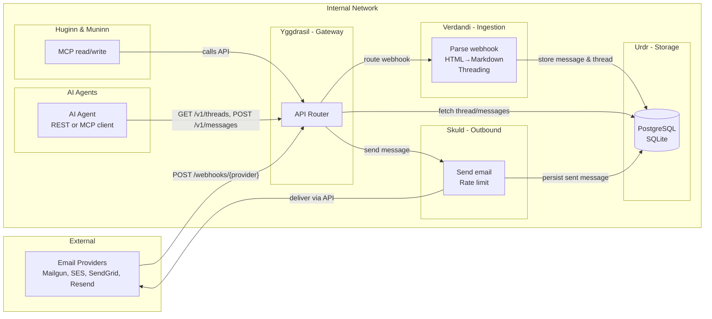
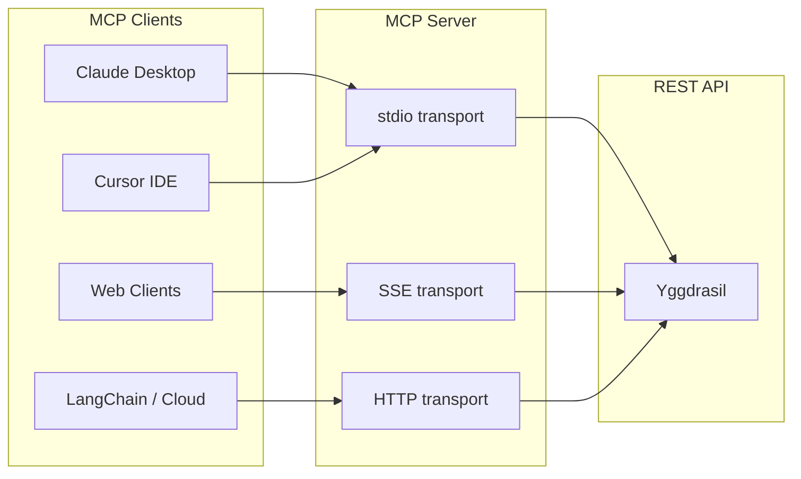
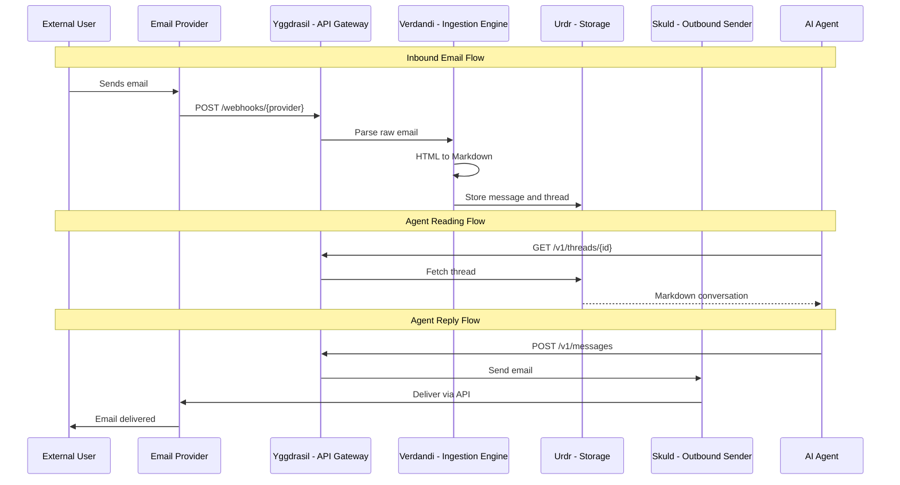
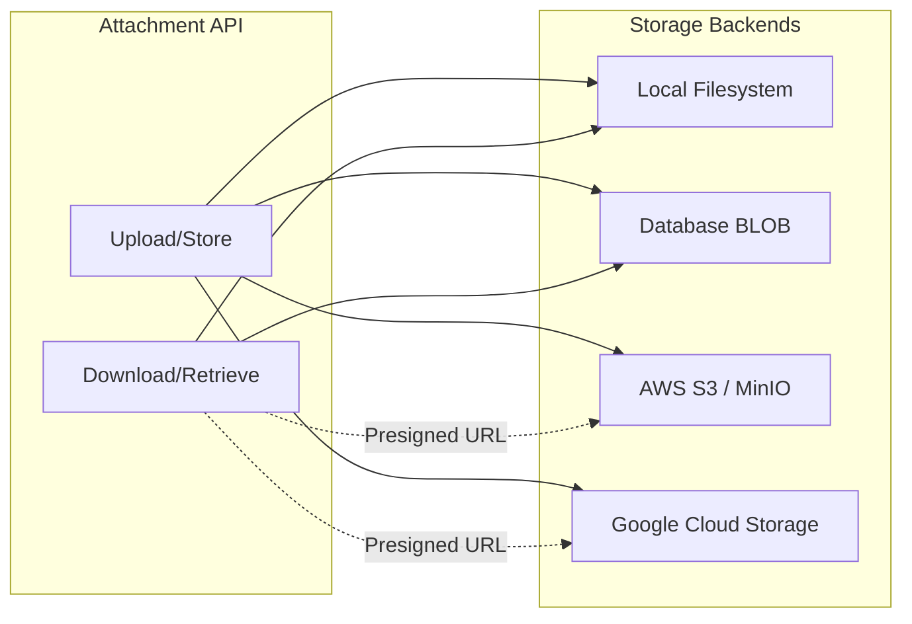

NornWeave's architecture uses thematic naming inspired by Norse mythology, with each component having a clear technical purpose.

## Component Overview

| Layer | Name | Roles |
|-----------|---------------|-------------------|
| Storage Layer | **Urdr** (The Well) | Database adapters for persistence |
| Attachment Storage | **Urdr** (Adapters) | File storage (Local, S3, GCS, Database) |
| Ingestion Engine | **Verdandi** (The Loom) | Webhook processing, HTML to Markdown parsing |
| API & Outbound | **Skuld** (The Prophecy) | REST API, email sending, rate limiting |
| API Gateway | **Yggdrasil** | Central router connecting all providers |
| MCP Tools | **Huginn & Muninn** | Read/write tools for AI agents |

### Component connections and actions

The diagram below shows how the main components connect and what actions they perform on each other.



- **Inbound:** Provider sends webhook → Yggdrasil routes → Verdandi parses and threads → Urdr stores.
- **Read:** Agent (or MCP) calls API → Yggdrasil → Urdr returns thread/messages.
- **Reply:** Agent (or MCP) posts message → Yggdrasil → Skuld sends via provider and Urdr stores the sent message.

## System Architecture Diagram

```mermaid
flowchart TB
    subgraph external [External]
        subgraph providers [Email Providers]
            MG[Mailgun]
            SES[AWS SES]
            SG[SendGrid]
            RS[Resend]
        end
        subgraph cloudstorage [Cloud Storage]
            S3[AWS S3]
            GCS[Google Cloud Storage]
        end
    end
    
    subgraph internal [Internal Network]
        subgraph agents [AI Agents]
            Agent1[Claude / Cursor<br/>stdio]
            Agent2[Web Clients<br/>SSE]
            Agent3[LangChain / Cloud<br/>HTTP]
        end

        subgraph mcp [Huginn & Muninn - MCP Server]
            Transports[Transports<br/>stdio | SSE | HTTP]
            Resources[Resources<br/>email://inbox | email://thread]
            Tools[Tools<br/>create_inbox | send_email | search_email<br/>list_attachments | get_attachment_content]
        end

        subgraph yggdrasil [Yggdrasil - API Gateway]
            WH[Webhook Routes]
            API[REST API v1<br/>inboxes | threads | messages | attachments]
        end
        
        subgraph verdandi [Verdandi - Ingestion Engine]
            Parser[HTML Parser]
            Sanitizer[Cruft Remover]
            Threader[Threading Logic]
            AttExtract[Attachment Extractor]
        end
        
        subgraph urdr [Urdr - Storage Layer]
            PG[(PostgreSQL)]
            SQLite[(SQLite)]
            subgraph attstorage [Attachment Storage]
                Local[Local Filesystem]
                DBBlob[Database BLOB]
            end
        end
        
        subgraph skuld [Skuld - Outbound Sender]
            Sender[Email Sender]
            RateLimiter[Rate Limiter]
        end
    end
    
    providers --> WH
    WH --> verdandi
    verdandi --> urdr
    AttExtract --> attstorage
    AttExtract -.-> cloudstorage
    Agent1 --> Transports
    Agent2 --> Transports
    Agent3 --> Transports
    Transports --> Resources
    Transports --> Tools
    Resources --> API
    Tools --> API
    API --> urdr
    API --> skuld
    API --> attstorage
    API -.-> cloudstorage
    skuld --> providers
```

## Data Flow

### Inbound Email Flow

1. External user sends an email to your inbox address
2. Email provider (Mailgun, etc.) calls the webhook endpoint
3. **Yggdrasil** receives the webhook and routes to the appropriate handler
4. **Verdandi** parses the raw email:
   - Converts HTML to Markdown
   - Removes reply cruft ("On Jan 1, John wrote:")
   - Extracts attachments
5. **Verdandi** determines threading using `In-Reply-To` and `References` headers
6. **Urdr** stores the message and updates the thread

### Agent Reading Flow

1. AI Agent calls `GET /v1/threads/{id}` (or uses MCP)
2. **Yggdrasil** routes the request
3. **Urdr** fetches the thread and messages
4. Response formatted as LLM-ready conversation

### Agent Reply Flow

1. AI Agent calls `POST /v1/messages` (or uses MCP `send_email`)
2. **Yggdrasil** routes the request
3. **Skuld** processes the outbound message:
   - Converts Markdown to HTML
   - Adds threading headers
   - Applies rate limiting
4. **Skuld** sends via the configured provider
5. **Urdr** stores the sent message

### MCP Transport Options

The MCP server (Huginn & Muninn) supports three transport types to accommodate different deployment scenarios:

| Transport | Use Case | How it Works |
|-----------|----------|--------------|
| **stdio** | Claude Desktop, Cursor, local CLI | Communicates via standard input/output |
| **SSE** | Web-based MCP clients, browser integrations | Server-Sent Events over HTTP |
| **HTTP** | Cloud deployments, LangChain, load-balanced setups | Streamable HTTP requests |



## Sequence Diagram



## Database Schema

The storage layer enforces this schema through the `StorageAdapter`:

### Inboxes Table

| Column | Type | Description |
|--------|------|-------------|
| `id` | UUID | Primary key |
| `email_address` | String | Unique email address |
| `name` | String | Display name |
| `provider_config` | JSON | Provider-specific metadata |
| `created_at` | Timestamp | Creation time |

### Threads Table

| Column | Type | Description |
|--------|------|-------------|
| `id` | UUID | Primary key |
| `inbox_id` | UUID | Foreign key to Inbox |
| `subject` | Text | Thread subject |
| `last_message_at` | Timestamp | Last activity |
| `participant_hash` | String | Hash of participants for grouping |

### Messages Table

| Column | Type | Description |
|--------|------|-------------|
| `id` | UUID | Primary key |
| `thread_id` | UUID | Foreign key to Thread |
| `inbox_id` | UUID | Foreign key to Inbox |
| `provider_message_id` | String | Message-ID header |
| `direction` | Enum | `INBOUND` or `OUTBOUND` |
| `content_raw` | Text | Original HTML/Text |
| `content_clean` | Text | LLM-ready Markdown |
| `metadata` | JSON | Headers, attachments, etc. |
| `created_at` | Timestamp | Message time |

### Attachments Table

| Column | Type | Description |
|--------|------|-------------|
| `id` | UUID | Primary key |
| `message_id` | UUID | Foreign key to Message |
| `filename` | String | Original filename |
| `content_type` | String | MIME type |
| `size_bytes` | Integer | File size in bytes |
| `disposition` | String | `attachment` or `inline` |
| `content_id` | String | Content-ID for inline images |
| `storage_backend` | String | `local`, `database`, `s3`, or `gcs` |
| `storage_path` | String | Path/key in storage backend |
| `content_hash` | String | SHA-256 hash for deduplication |
| `content` | Binary | Optional: for database blob storage |
| `created_at` | Timestamp | Creation time |

## Attachment Storage Architecture

NornWeave supports multiple storage backends for email attachments:



| Backend | Best For | URL Type |
|---------|----------|----------|
| **Local** | Development, single-server | Signed API URL |
| **Database** | Simple deployments, small files | Signed API URL |
| **S3** | Production, scalable | Native presigned URL |
| **GCS** | Google Cloud deployments | Native presigned URL |


For cloud storage backends (S3, GCS), download URLs are presigned directly by the cloud provider, allowing clients to download without passing through NornWeave's API.

