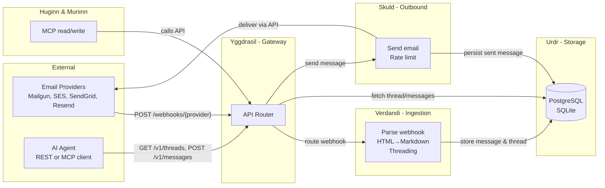
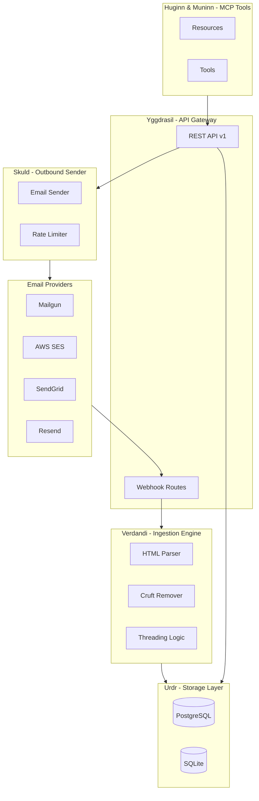
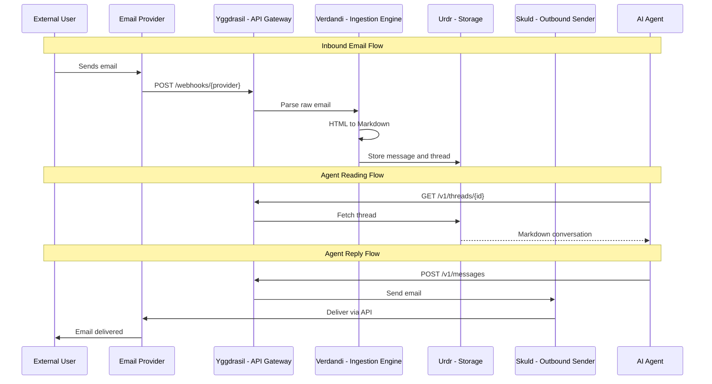

NornWeave's architecture uses thematic naming inspired by Norse mythology, with each component having a clear technical purpose.

## Component Overview

| Layer | Name | Roles |
|-----------|---------------|-------------------|
| Storage Layer | **Urdr** (The Well) | Database adapters for persistence |
| Ingestion Engine | **Verdandi** (The Loom) | Webhook processing, HTML to Markdown parsing |
| API & Outbound | **Skuld** (The Prophecy) | REST API, email sending, rate limiting |
| API Gateway | **Yggdrasil** | Central router connecting all providers |
| MCP Tools | **Huginn & Muninn** | Read/write tools for AI agents |

### Component connections and actions

The diagram below shows how the main components connect and what actions they perform on each other.



- **Inbound:** Provider sends webhook → Yggdrasil routes → Verdandi parses and threads → Urdr stores.
- **Read:** Agent (or MCP) calls API → Yggdrasil → Urdr returns thread/messages.
- **Reply:** Agent (or MCP) posts message → Yggdrasil → Skuld sends via provider and Urdr stores the sent message.

## System Architecture Diagram



## Data Flow

### Inbound Email Flow

1. External user sends an email to your inbox address
2. Email provider (Mailgun, etc.) calls the webhook endpoint
3. **Yggdrasil** receives the webhook and routes to the appropriate handler
4. **Verdandi** parses the raw email:
   - Converts HTML to Markdown
   - Removes reply cruft ("On Jan 1, John wrote:")
   - Extracts attachments
5. **Verdandi** determines threading using `In-Reply-To` and `References` headers
6. **Urdr** stores the message and updates the thread

### Agent Reading Flow

1. AI Agent calls `GET /v1/threads/{id}` (or uses MCP)
2. **Yggdrasil** routes the request
3. **Urdr** fetches the thread and messages
4. Response formatted as LLM-ready conversation

### Agent Reply Flow

1. AI Agent calls `POST /v1/messages` (or uses MCP `send_email`)
2. **Yggdrasil** routes the request
3. **Skuld** processes the outbound message:
   - Converts Markdown to HTML
   - Adds threading headers
   - Applies rate limiting
4. **Skuld** sends via the configured provider
5. **Urdr** stores the sent message

## Sequence Diagram



## Database Schema

The storage layer enforces this schema through the `StorageAdapter`:

### Inboxes Table

| Column | Type | Description |
|--------|------|-------------|
| `id` | UUID | Primary key |
| `email_address` | String | Unique email address |
| `name` | String | Display name |
| `provider_config` | JSON | Provider-specific metadata |
| `created_at` | Timestamp | Creation time |

### Threads Table

| Column | Type | Description |
|--------|------|-------------|
| `id` | UUID | Primary key |
| `inbox_id` | UUID | Foreign key to Inbox |
| `subject` | Text | Thread subject |
| `last_message_at` | Timestamp | Last activity |
| `participant_hash` | String | Hash of participants for grouping |

### Messages Table

| Column | Type | Description |
|--------|------|-------------|
| `id` | UUID | Primary key |
| `thread_id` | UUID | Foreign key to Thread |
| `inbox_id` | UUID | Foreign key to Inbox |
| `provider_message_id` | String | Message-ID header |
| `direction` | Enum | `INBOUND` or `OUTBOUND` |
| `content_raw` | Text | Original HTML/Text |
| `content_clean` | Text | LLM-ready Markdown |
| `metadata` | JSON | Headers, attachments, etc. |
| `created_at` | Timestamp | Message time |

## Directory Structure

The codebase follows the thematic naming:

```
src/nornweave/
├── core/           # Shared interfaces and config
├── urdr/           # Storage layer
│   └── adapters/   # PostgreSQL, SQLite implementations
├── verdandi/       # Ingestion engine
│   ├── parser.py   # HTML to Markdown
│   ├── sanitizer.py # Cruft removal
│   └── threading.py # Thread grouping
├── skuld/          # Outbound layer
│   ├── sender.py   # Email sending
│   └── rate_limiter.py
├── yggdrasil/      # API gateway
│   ├── app.py      # FastAPI application
│   └── routes/     # API endpoints
├── huginn/         # MCP resources
└── muninn/         # MCP tools
```
