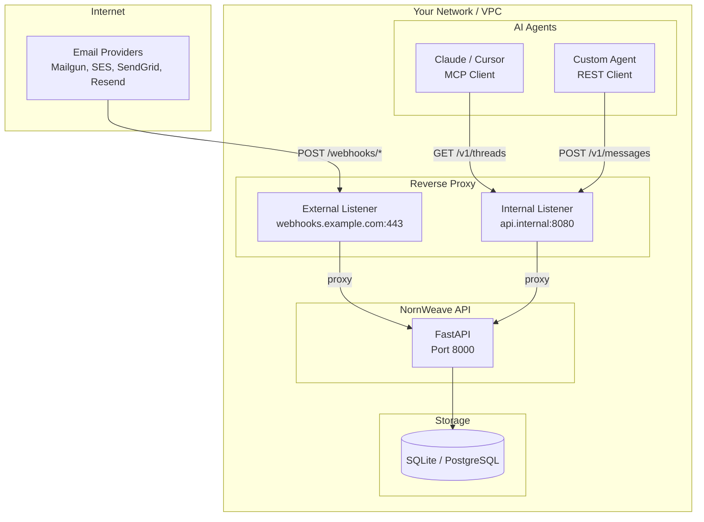

## Deployment Architecture

NornWeave exposes two types of endpoints with different security requirements:

- **Internal API** (`/v1/*`): Used by AI agents to read threads, send messages, and search. Should only be accessible from your internal network.
- **Webhook endpoints** (`/webhooks/*`): Receive inbound email events from providers (Mailgun, SES, SendGrid, Resend). Must be publicly accessible.

The recommended architecture uses a reverse proxy to control access:



- **External access**: Only `/webhooks/*` and `/health` are exposed through the external listener
- **Internal access**: AI agents connect through the internal listener, which has full API access
- **Storage**: The database (SQLite or PostgreSQL) runs inside your network, accessible only by the NornWeave API

---

NornWeave can be installed from PyPI (quickest), using Docker (recommended for production), or from source using uv.

## Package Extras

NornWeave uses optional extras to keep the base installation lightweight:

| Installation | Command | Use Case |
|--------------|---------|----------|
| **Base** | `pip install nornweave` | SQLite, Mailgun/SES/SendGrid/Resend |
| **IMAP/SMTP** | `pip install nornweave[smtpimap]` | Poll any IMAP mailbox, send via SMTP |
| **PostgreSQL** | `pip install nornweave[postgres]` | Production PostgreSQL support |
| **MCP** | `pip install nornweave[mcp]` | AI agent integration (Claude, Cursor) |
| **Full** | `pip install nornweave[all]` | All features |

For development from source, use `make install-dev` which installs all extras.


The base package includes SQLite support and four HTTP-based email providers (Mailgun, SES, SendGrid, Resend). IMAP/SMTP requires `[smtpimap]`, PostgreSQL requires `[postgres]`.


## From PyPI (Quickstart)

The fastest way to get NornWeave running. Uses SQLite by default — no database setup or migrations required. Tables are created automatically on first startup.

```bash
pip install nornweave
nornweave api
```

The API will be available at `http://localhost:8000`. Data is stored in `./nornweave.db`.

For AI agent integration via MCP:

```bash
pip install nornweave[mcp]
nornweave api    # start the API server (in one terminal)
nornweave mcp    # start the MCP server (in another terminal)
```


The base package uses SQLite and includes Mailgun, SES, SendGrid, and Resend. For IMAP/SMTP, add `[smtpimap]`. For PostgreSQL, add `[postgres]` and set `DB_DRIVER=postgres`.


## Using Docker (Recommended for Production)

Docker is the easiest way to get started with NornWeave.

### Prerequisites

- Docker 20.10+
- Docker Compose 2.0+

### Steps

{}

### Clone the Repository

```bash
git clone https://github.com/DataCovey/nornweave.git
cd nornweave
```

### Configure Environment

```bash
cp .env.example .env
```

Edit `.env` with your settings:

```bash
# Database (SQLite is the default — no database config needed for quickstart)
# For production with PostgreSQL, uncomment and configure:
# DB_DRIVER=postgres
# POSTGRES_HOST=postgres
# POSTGRES_PORT=5432
# POSTGRES_DB=nornweave
# POSTGRES_USER=nornweave
# POSTGRES_PASSWORD=your-secure-password

# Email Domain (used for inbox addresses: username@EMAIL_DOMAIN)
EMAIL_DOMAIN=mail.yourdomain.com

# Email Provider
EMAIL_PROVIDER=mailgun  # or: sendgrid, ses, resend
MAILGUN_API_KEY=your-api-key
MAILGUN_DOMAIN=mail.yourdomain.com

# API Security (not yet enforced — reserved for future use)
# API_KEY=your-api-key
```

### Start the Stack

```bash
docker compose up -d
```

### Run Database Migrations (PostgreSQL only)

SQLite tables are created automatically. If you're using PostgreSQL, run Alembic migrations:

```bash
docker compose exec api alembic upgrade head
```

### Verify Installation

```bash
curl http://localhost:8000/health
```

You should see: `{"status": "ok"}`

### Configure Reverse Proxy (Production)

For production deployments, use a reverse proxy to separate internal and external access. Here's a minimal nginx configuration:

```nginx
# External server - only webhooks (public)
server {
    listen 443 ssl;
    server_name webhooks.example.com;

    ssl_certificate /etc/nginx/ssl/cert.pem;
    ssl_certificate_key /etc/nginx/ssl/key.pem;

    # Health check for load balancers
    location = /health {
        proxy_pass http://127.0.0.1:8000;
    }

    # Only webhook endpoints are public
    location /webhooks/ {
        proxy_pass http://127.0.0.1:8000;
        proxy_set_header Host $host;
        proxy_set_header X-Real-IP $remote_addr;
        proxy_set_header X-Forwarded-For $proxy_add_x_forwarded_for;
        proxy_set_header X-Forwarded-Proto $scheme;
    }

    # Block everything else
    location / {
        return 403;
    }
}

# Internal server - full API access (VPC/private network only)
server {
    listen 8080;  # Bind to internal interface only
    server_name api.internal;

    location / {
        proxy_pass http://127.0.0.1:8000;
        proxy_set_header Host $host;
        proxy_set_header X-Real-IP $remote_addr;
        proxy_set_header X-Forwarded-For $proxy_add_x_forwarded_for;
        proxy_set_header X-Forwarded-Proto $scheme;
    }
}
```

With this configuration:
- Email providers send webhooks to `https://webhooks.example.com/webhooks/{provider}`
- AI agents connect to `http://api.internal:8080/v1/*` from within your network
- The NornWeave API itself (`127.0.0.1:8000`) is not directly exposed

### (Optional) Validate with Python SDK

For a comprehensive validation of all API endpoints, you can use the Python SDK validation script:

```bash
cd clients/python
uv pip install -e .
python scripts/validate_local.py
```

This runs 22 integration tests covering all SDK features including sync/async clients, pagination, error handling, and raw response access.

{}

## Using uv (Development)

For development or when you need more control over the installation.

### Prerequisites

- Python 3.14+
- [uv](https://github.com/astral-sh/uv) package manager
- PostgreSQL 15+ (optional — SQLite is used by default)

### Steps

{}

### Clone and Install

```bash
git clone https://github.com/DataCovey/nornweave.git
cd nornweave

# Install dependencies
make install-dev
```

### Configure Environment

```bash
cp .env.example .env
# Edit .env with your provider settings
```

The default configuration uses SQLite, which requires no database setup.

### (Optional) Start PostgreSQL

If you prefer PostgreSQL, set `DB_DRIVER=postgres` in your `.env` and start a PostgreSQL instance:

```bash
docker compose up -d postgres
```

Or use your own PostgreSQL instance.

### Run Migrations (PostgreSQL only)

SQLite tables are created automatically on startup. If you're using PostgreSQL, run:

```bash
make migrate
```

### Start Development Server

```bash
make dev
```

The API will be available at `http://localhost:8000`.


{}

## MCP Server (AI Agent Integration)

The MCP (Model Context Protocol) server allows AI agents like Claude, Cursor, and LangChain to interact with NornWeave email capabilities.

### Install MCP Support

```bash
pip install nornweave[mcp]
```

### Run the MCP Server

The MCP server supports three transport types:

```bash
# stdio (default) - for Claude Desktop, Cursor
nornweave mcp

# SSE - for web-based MCP clients
nornweave mcp --transport sse --port 3000

# HTTP - for cloud deployments, LangChain
nornweave mcp --transport http --port 3000
```

### Configure Claude Desktop / Cursor

Add to your MCP client configuration (`~/.config/claude/config.json` or Cursor settings):

```json
{
  "mcpServers": {
    "nornweave": {
      "command": "nornweave",
      "args": ["mcp"],
      "env": {
        "NORNWEAVE_API_URL": "http://localhost:8000"
      }
    }
  }
}
```


The API server must be running for the MCP server to work. Start it with `nornweave api` (uses SQLite by default) or `docker compose up`.


See the [MCP Integration Guide](/docs/api/mcp/) for detailed usage.

## Next Steps


  
  

